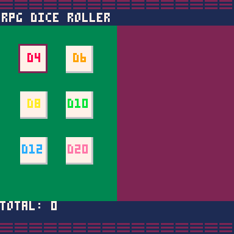
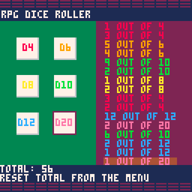
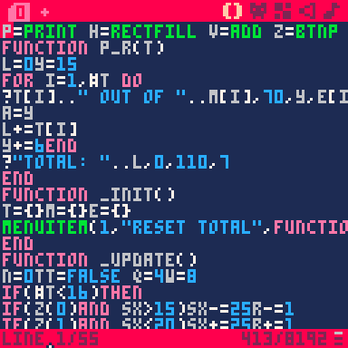

# PICO1kJam_Dice
This project was created for the [PICO-1K Jam](https://itch.io/jam/pico-1k) on Itch.io.
The program is a dice roller for D4's, D6's, D8's, D10's, D12's and D20's to be used for table-top RPGs like Dungeons and Dragons.
Per the rules of the game jam, the program must be no longer than 1024 characters of code!
My program ended up consisting of 999 characters of code.

Some screengrabs and a GIF:

Here is the code in full:

`p=print h=rectfill v=add z=btnp sx=10sy=24r=1a=-9 \
function p_r(t)
l=0y=15
for i=1,#t do
?t[i].." out of "..m[i],70,y,e[i]
a=y
l+=t[i]
y+=6end
?"total: "..l,0,110,7
end
function _init()
t={}m={}e={}
menuitem(1,"reset total",function()t={}m={}e={}a=-9end)
end
function _update()
n=0tt=false q=4w=8
if(#t<16)then
if(z(0)and sx>15)sx-=25r-=1
if(z(1)and sx<20)sx+=25r+=1
if(z(2)and sy>24)sy-=25r-=2
if(z(3)and sy<50)sy+=25r+=2
if(z(4))then
?"\ace"
for i=1,6do
if(r==i)n=flr(rnd(q))+1v(t,n)v(m,q)v(e,w)
q+=2w+=1
if(q>12)q=20w=14
end
end
else
tt=true
end
end
function _draw()
cls(1)
h(64,14,127,109,2)
p("rpg dice roller",1,7,7)
h(0,14,63,109,3)
p("",0,0,2)
?"\*8▤\*8▤",0,0,2
?"\*8▤\*8▤",0,122,2
yy=25
for i=1,6do
xx=11
if(i%2==0)xx=36
if(i==3or i==5)yy+=25
h(xx,yy,xx+14,yy+14,6)
h(xx,yy,xx+13,yy+13,7)
end
p("d4",15,29,8)p("d6",40,29,9)p("d8",15,54,10)p("d10",37,54,11)p("d12",12,79,12)p("d20",37,79,14)
h(69,a,117,a+4,4)
rect(sx,sy,sx+15,sy+15,2)
p_r(t)
if(tt==true) p("reset total from the menu",7)
end`
